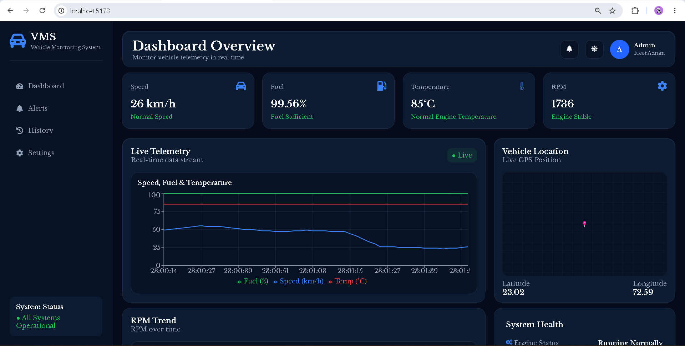
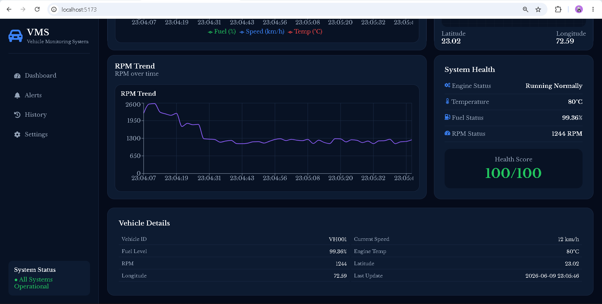
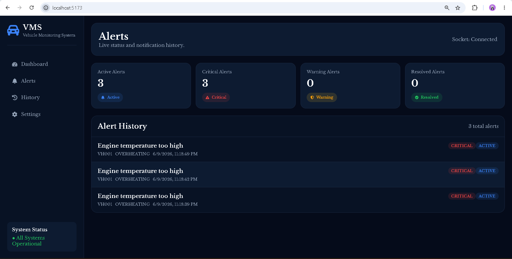
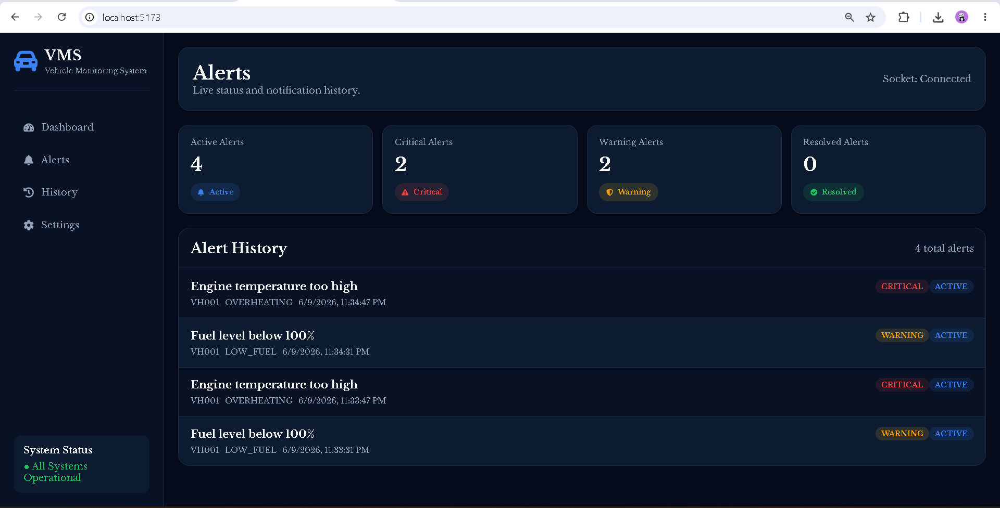
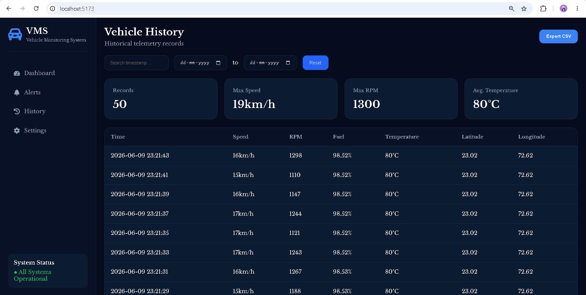
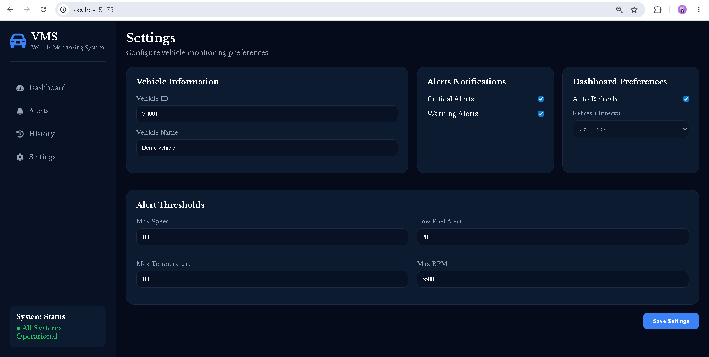

# Real-Time Vehicle Monitoring System

A full-stack application for monitoring vehicle telemetry and alerts in real-time. The project includes a Node.js + Express backend with Socket.io for real-time events and a React + Vite frontend (TypeScript) for the dashboard and settings UI.

## Features
- Real-time telemetry streaming via Socket.io
- Alerts management with severity and status
- Interactive maps and live charts in the frontend
- Theming support (dark/light) using CSS variables

## Structure
- `backend/` — Express server, MongoDB integration, and telemetry socket
- `frontend/` — React + Vite application with dashboard and settings

## Development
Development and setup steps are documented in each project folder. See the project-level READMEs for full instructions:

- `backend/README.md` — backend setup, environment variables, and simulator build notes
- `frontend/README.md` — frontend setup, environment variables, and dev/build commands

## Media and Documentation
### Dashboard Page

### Alerts Page

### History Page

### Setting Page

### Video

